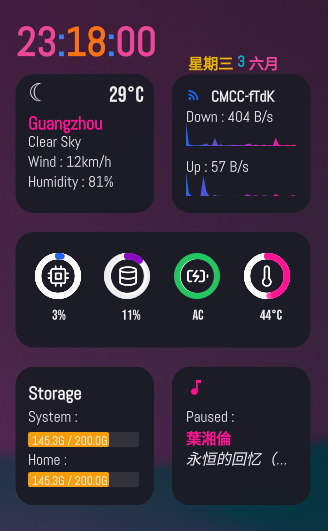
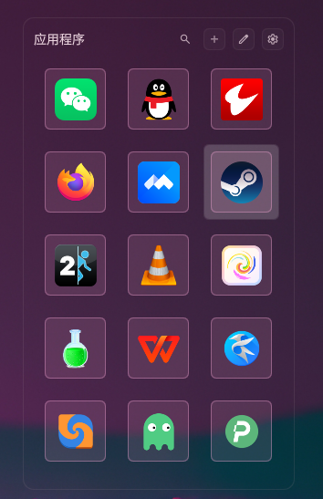
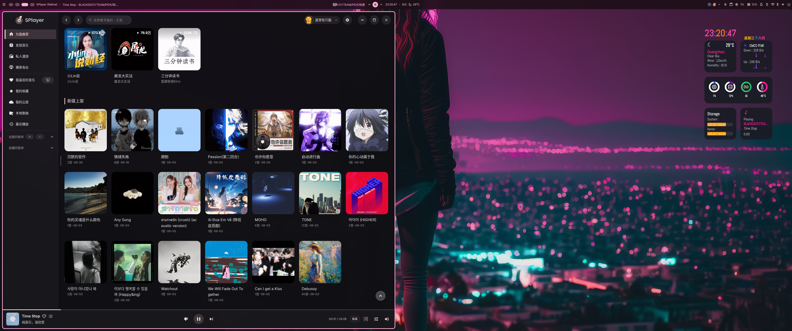
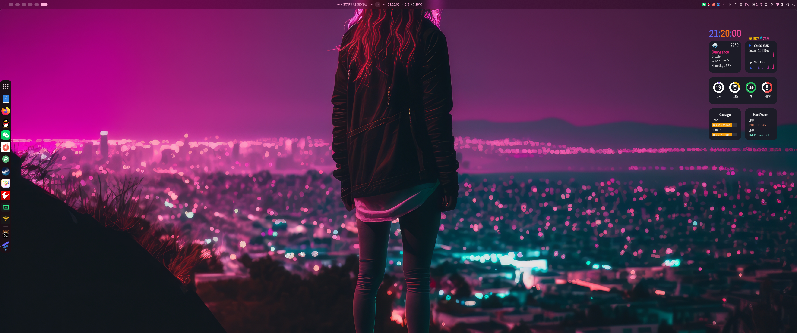
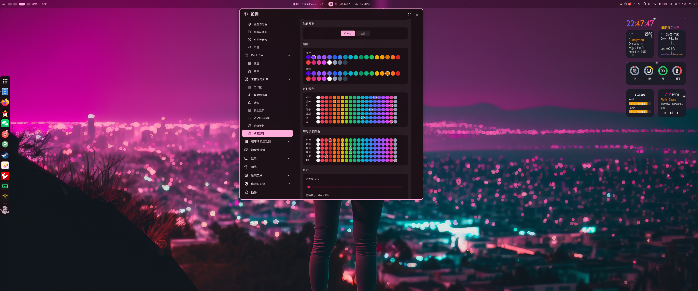

# DMS Conky Plugin

DankMaterialShell 桌面插件 — Conky 风格系统监控 + 应用启动器，鼠标悬停切换视图。

# DMS上实现conky功能

## 截图

## 系统监控                                                        应用启动器
参考: https://www.gnome-look.org/p/1869486/    参考：https://github.com/hthienloc/dms-app-launcher

   


## 整体显示




## 功能

- **系统监控**：时钟、天气、CPU/内存/电池/温度环形仪表、网络速率图、磁盘使用、音乐播放器
- **应用启动器**：鼠标移入系统监控区域(除去Storage和音乐播放区域) 自动切换到启动器，移出回到系统监控
- **硬件信息**：暂停音乐时自动显示 CPU/GPU 型号（随机彩色文字），每次切换颜色刷新
- **音乐播放**：播放时显示上一曲/暂停/下一曲三个控制按钮
- **音乐播放/硬件信息切换**：硬件信息界面时双击鼠标切换到音乐播放界面
- **悬停排除区**：Storage 和 HardWare 底部区域不触发应用启动器切换，防止误触
- **粒子消散动画**：整个conky界面背景显示粒子效果
- **默认界面设置**：可以设置默认的界面是:系统监控/应用启动器

## 安装

```bash
cp -r conky ~/.config/DankMaterialShell/plugins/
```

然后在 DMS 中的设置  → 工作区与部件 → 桌面部件 → 添加部件 → 选择Conky

## 设置

Conky可配置项目：
- 显示模块开关（时钟/天气/网络/音乐）
- 主色/辅色
- 时钟颜色/环形仪表颜色
- 背景不透明度
- 应用启动器：图标大小、视图模式、背景不透明度

## 依赖

- [DankMaterialShell](https://github.com/hthienloc/DankMaterialShell)
- DgopService、WeatherService、MprisController、BatteryService（DMS 内置服务）

## 快捷键

- `ESC`：在应用启动器中退出弹窗/返回监控视图

## 中文翻译 

sudo cp zh_CN.json /usr/share/quickshell/dms/translations/poexports/zh_CN.json
