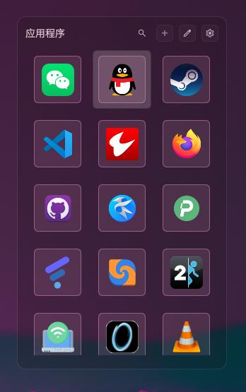

# DMS Conky Plugin

DankMaterialShell 桌面插件 — Conky 风格系统监控 + 应用启动器，鼠标悬停切换视图。

# 界面参考 conky

https://www.gnome-look.org/p/1869486/
https://github.com/hthienloc/dms-app-launcher

## 截图

### 系统监控


### 应用启动器




## 功能

- **系统监控**：时钟、天气、CPU/内存/电池/温度环形仪表、网络速率图、磁盘使用、音乐播放器
- **应用启动器**：Grid/List/Compact 三视图，搜索过滤，拖拽排序，添加/管理应用
- **鼠标悬停切换**：鼠标移入自动切换到启动器，移出回到监控视图

## 安装

```bash
cp -r conky ~/.config/DankMaterialShell/plugins/
```

然后在 DMS 中：Settings → Plugins → Scan → Enable "Conky" → Desktop Widgets → Add → Conky

## 设置

右键 Widget → Settings，可配置：
- 显示模块开关（时钟/天气/网络/音乐）
- 主色/辅色
- 背景不透明度
- Widget 尺寸
- 应用启动器：图标大小、视图模式、背景不透明度

## 依赖

- [DankMaterialShell](https://github.com/hthienloc/DankMaterialShell)
- DgopService、WeatherService、MprisController、BatteryService（DMS 内置服务）

## 快捷键

- `ESC`：在应用启动器中退出弹窗/返回监控视图
