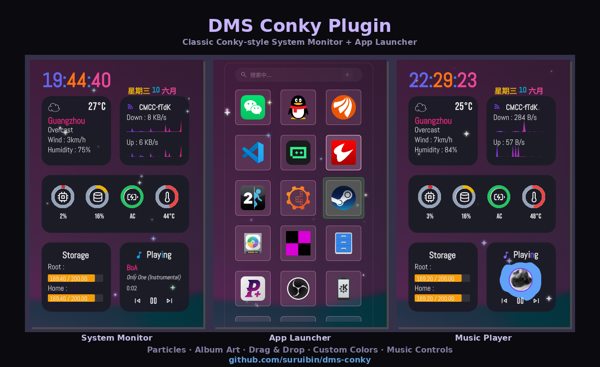
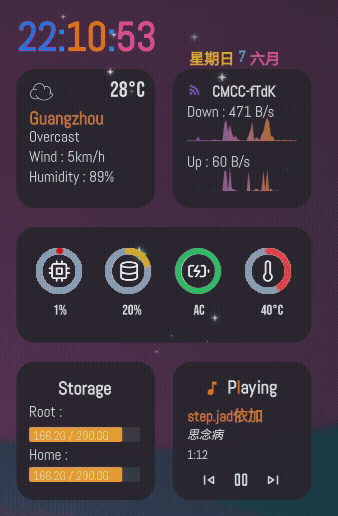
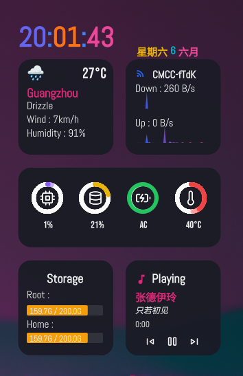

# DMS Conky Plugin / DMS上实现conky功能

- DankMaterialShell 桌面插件 — Conky 风格系统监控 + 应用启动器，鼠标悬停切换视图。

## 截图




## 整体显示




## 功能

- **系统监控**：时钟、天气、CPU/内存/电池/温度环形仪表、网络速率图、磁盘使用、音乐播放器
- **应用启动器**：鼠标移入系统监控区域(除去Storage和音乐播放区域) 自动切换到启动器，移出回到系统监控
- **硬件信息**：暂停音乐时自动显示 CPU/GPU 型号（随机彩色文字），每次切换颜色刷新
- **音乐播放**：播放时显示上一曲/暂停/下一曲三个控制按钮
- **音乐播放/硬件信息切换**：硬件信息界面时双击鼠标切换到音乐播放界面
- **悬停排除区**：Storage 和 HardWare 底部区域不触发应用启动器切换，防止误触
- **粒子消散动画**：整个conky界面背景显示粒子效果
- **默认界面设置**：可以设置默认的界面是:系统监控/
- **dmsfilemanager界面**：双击Storage可以切换显示文件管理器

## 安装
```bash
dms plugins install dmsconky
```
- 然后手动将dmsfilemanager 复制到 ~/.config/DankMaterialShell/plugins
- 步骤一: 在 DMS 中的设置 -> 插件 -> 可用插件 使能 DMS Conky / DMS File Manager
- 步骤二: 在 DMS 中的设置 -> 工作区与部件 -> 桌面部件 -> 添加部件 -> 选择DMS Conky / DMS File Manager

## 设置

Conky可配置项目：
- 显示模块开关（时钟/天气/网络/音乐）
- 主色/辅色
- 时钟颜色/环形仪表颜色
- 背景不透明度
- 应用启动器：图标大小、视图模式、背景不透明度
- 显示AppImage程序图标: 在Appimage程序目录下创建一个名为AppIcon的文件夹，存放对应程序的图标即可 例如 bilibili.png 匹配Bilibili-1.17.5-x86_64.AppImage的图标

## 依赖

- [DankMaterialShell](https://github.com/hthienloc/DankMaterialShell)

## 快捷键

- `ESC`：在应用启动器中退出弹窗/返回监控视图

## 中文翻译 

- sudo cp zh_CN.json /usr/share/quickshell/dms/translations/poexports/zh_CN.json

## 默认播放器 SPlayer

- [SPlayer](https://github.com/SPlayer-Dev/SPlayer)


## 参考项目
- [conky](https://www.gnome-look.org/p/1869486/)
- [launcher](https://github.com/hthienloc/dms-app-launcher)
- [folderView](https://github.com/hthienloc/dms-folder-view)
